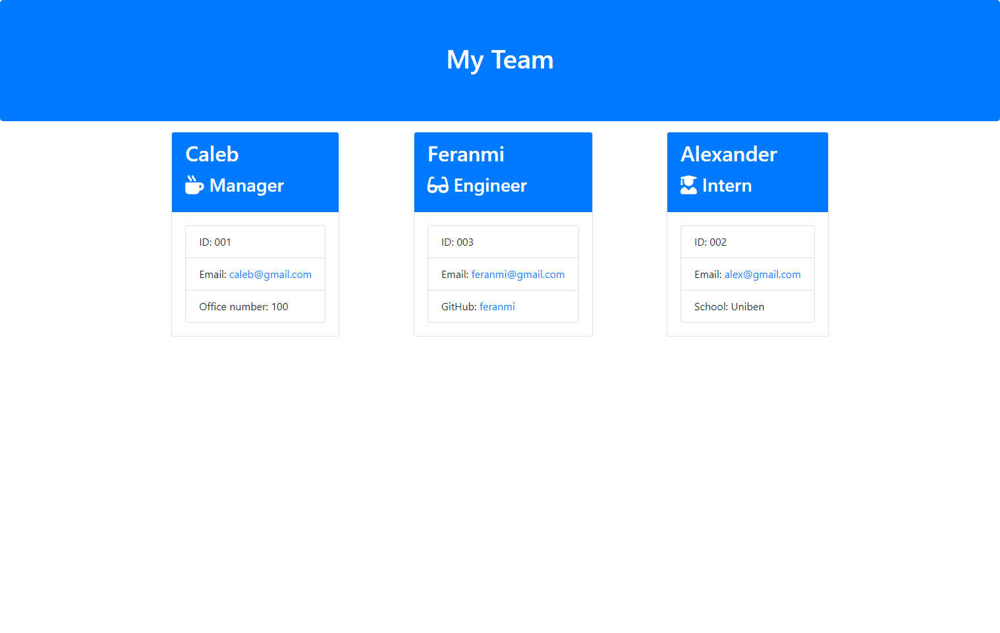

# TEAM PROFILE GENERATOR

## Your Task

This week i built a web weather app using HTML, CSS, bootstrap,  Java Script and, NODE.JS.  This project helps generate a team page for managers it, takes in the name and personal details of each team member. In this project I made use of the following:

* Inquirer
* Arrays
* Call back functions
* Regular functions
* If/else statements
* Nested Conditional Statements

## Lessons Learned 

* How to use Inquirer to get data from users
* Using the FSwrite to generate external html pages 
* Using jest to test your code to ensure everything passes thereby reducing bugs 

## Challenges 
 * Passing answers into an array
 * Passing all thetest to ensure the function render could work

 
## Screnshot 

## Link to Project Repo
[ Repo link ](https://github.com/seuncaleb/Team-Profile-Generator-) 

## Project Image
]

 

If you have any questions, please contact me at: 
 
  Github Profile: [ SeunCaleb ]( https://github.com/seuncaleb )  

  Email:  calebibejigba@gmail.com

  LinkedIn: [ Caleb Ibejigba ]( https://www.linkedin.com/in/calebibejigba)

